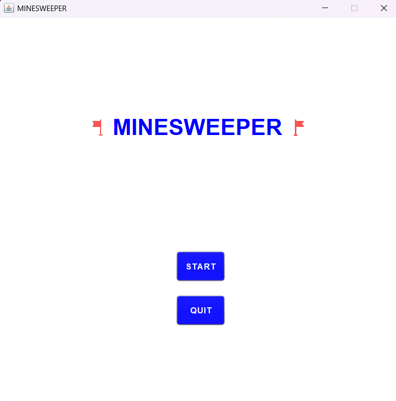
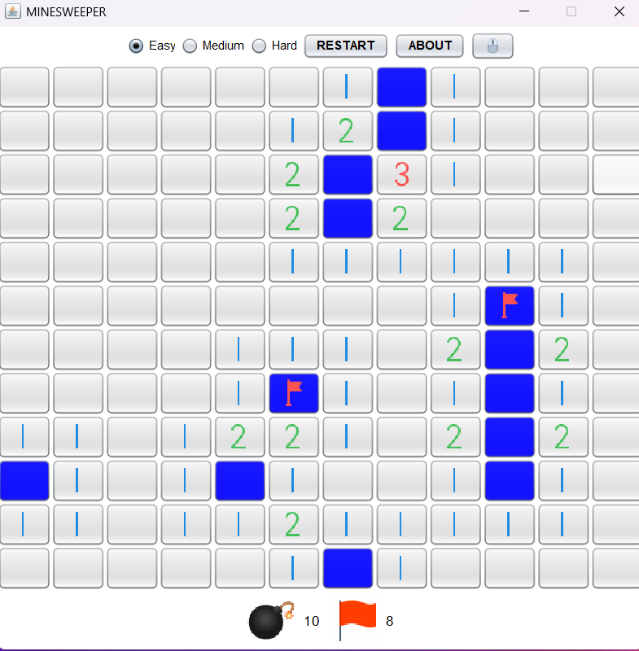
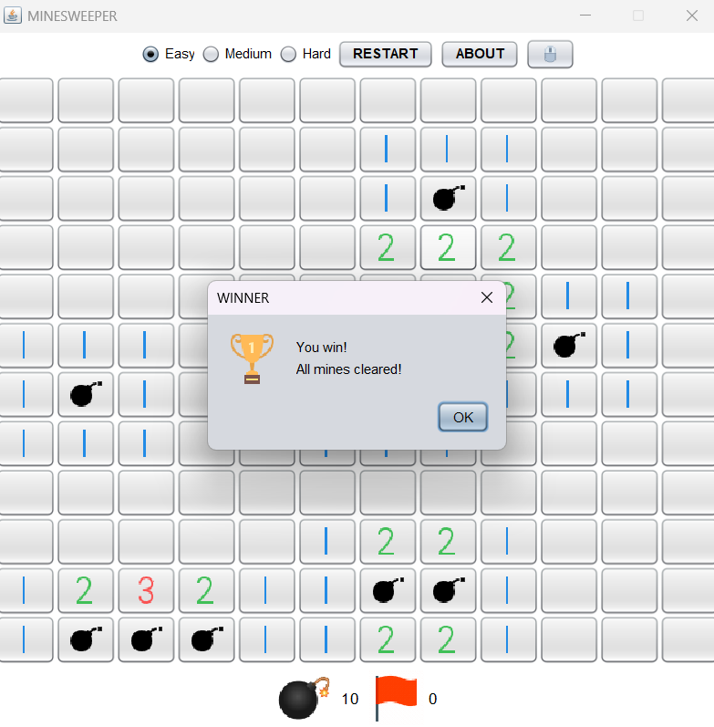
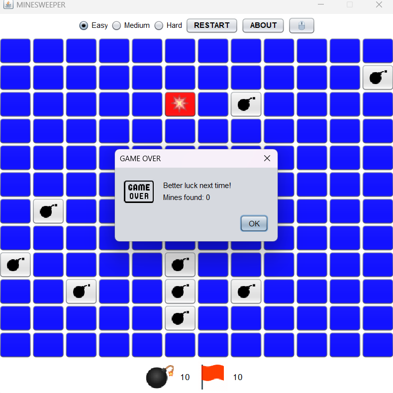
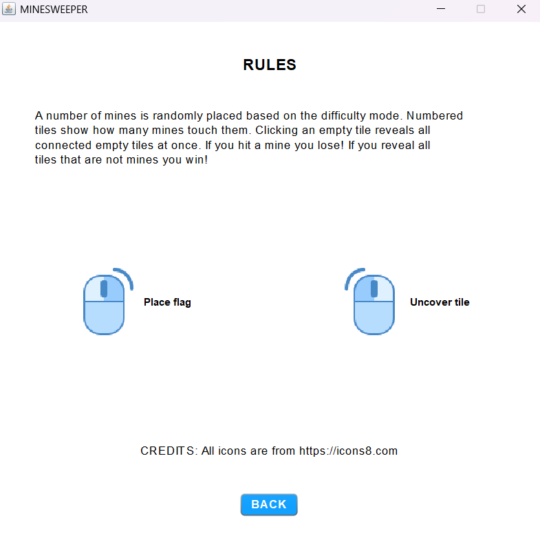

# Minesweeper

A desktop implementation of the classic **Minesweeper** game, developed in **Java** using **Java Swing**.

The project provides an interactive graphical interface where the player must uncover all safe tiles while avoiding hidden mines.

## 🎮 Features

- Classic Minesweeper gameplay
- Graphical user interface built with Java Swing
- Left-click to reveal tiles
- Right-click to place or remove flags
- Mine detection and game-over logic
- Win detection
- Interactive game board
- Restart / new game functionality
- Rules and instructions section

## 🛠️ Technologies

- **Java**
- **Java Swing**

## 🕹️ How to Play

The objective is to reveal all tiles that do not contain mines.

- **Left click** → Reveal a tile
- **Right click** → Place or remove a flag
- **Numbers** indicate how many mines are located in the surrounding tiles
- Avoid revealing a tile containing a mine
- Reveal all safe tiles to win the game

## 🖥️ Interface

The application includes a simple and intuitive graphical interface for navigating the game, playing Minesweeper, viewing the game outcome, and accessing the game rules.

### 🏠 Home Page

The main menu provides access to the game.



### 🎮 Game Board

The main game board allows the player to reveal tiles, place flags, and keep track of the remaining mines. The player can also restart the game and change the difficulty level.



### 🏆 Win Screen

The win message is displayed when the player successfully reveals all safe tiles.



### 💥 Game Over

The game-over message is displayed when the player reveals a tile containing a mine.



### 📖 Rules & Controls

The rules and controls section explains the objective of the game and the available actions, including left-click and right-click interactions.



## 🚀 Getting Started

### Requirements

- **Java JDK 21** or later
- **Apache NetBeans** (recommended)


### Running the Project

1. Clone the repository:

```bash
git clone https://github.com/margaritadeligiannidi/minesweeper.git

```bash
git clone https://github.com/margaritadeligiannidi/minesweeper.git
